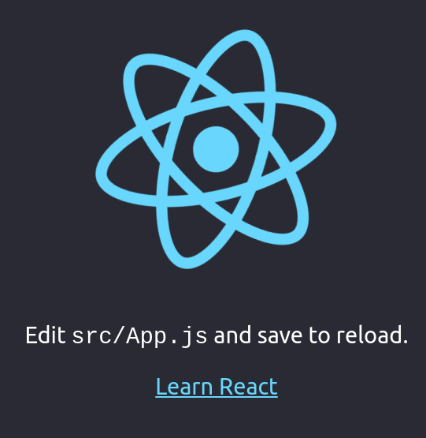

## How to consume the farmers blog api using React

[](https://app.codacy.com/gh/BuildForSDGCohort2/Team-212-groupa-frontendreact?utm_source=github.com&utm_medium=referral&utm_content=BuildForSDGCohort2/Team-212-groupa-frontendreact&utm_campaign=Badge_Grade_Settings)

[](https://www.youtube.com/watch?v=Nkkq9SifDjY&ab_channel=PaulWamaria)

### About

In this tutorial, I will be walking you step by step on how to consume the [farmers blog API](https://smartfarmendpoints.herokuapp.com/) and display the content in a beautiful, smart-looking and responsive UI/UX using [CreateReactApp](https://github.com/facebook/create-react-app).

### Requirements

1. npm==5.2 +

You need to have [npm](https://nodejs.org/en/download/) installed in your computer. npm5.2 + comes with a new binary called npx which is a package runner tool that will help us bootstrap our React application. The advantage with this is that we will not have to config @BaBel and Webpack because all this is already done under the hood.

Checkout this [tutorial](https://docs.npmjs.com/downloading-and-installing-node-js-and-npm) on how to install Nodejs and npm.

### Getting our feet wet

Lets get out our feet wet by diving into the project. I like backing up my projects on the cloud, in this case I will be using github. Login in to your github accout and create a repository. Make sure the public option,add readme file, add .gitignore and choose licence options are selected as shown below.


Next, we will clone the application so that we start working on it locally. Go to the repository youve just created and copy the link.

Then navigate to your project folder on your computer and clone the repository using the following command.

```
$ git clone https://github.com/BuildForSDGCohort2/Team-212-groupa-frontendreact.git
```

You will be requested for your github account password.

We now have access to the repository locally and we can now start workin on it. Change your directory into the new created folder :

```
$ cd Team-212-groupa-frontendreact
```

While inside the root folder, we are going to bootstrap a frontend application using the command _npx create-react-app smartfarm_ In this case, smartfarm is the name of our application. You can give it which ever name you like.

```
$ npx create-react-app smartfarm
```

After the above command completes successfully, the prjoject files are set up and we can now run our application locally by changing directory into the new created folder and starting the application.

```
$ cd smartfarm
```

```
$ yarn start
```

If we navigate into our browser on localholst port 3000, we are greeted with a nice logo. Our aplication is now runnning and all we need to do is add our code.


### Adding our project files

We will add our own project files and modify the existing ones to suit our needs.
Change your directory into the **src** folder and add the following folders and files.

1.  actions/
    1.  auth.js
    1.  articles.js
    1.  messages.js
1.  types/
    1. Types.js
1.  components

    1.  layout/

        1.  Navbar.js
        1.  Footer.js
        1.  Alerts.js

    1.  auth/
        1.  Login.js
        1.  Register.js
    1.  blog/
    1.  Home.js
    1.  Article.js

1.  assets/
1.  reducers/
    1.  index.js
    1.  auth.js
    1.  articles.js
    1.  errors.js
        1 . messages.js
1.  store.js

The files and folders are descriptive. For example the actions folder contain action files such as auth that will be holding the functions making API requests.

### Implementing State management.

We are going to use the following dependencies in our applicaction for state management.

1.  React-redux and redux for state management.[ Checkout how to impelement react-redux in create-react-app](https://www.codementor.io/@rajjeet/step-by-step-how-to-add-redux-to-a-react-app-11tcgslmvi)
1.  Redux-devtools-extension
1.  redux-thunk

Run the following command on your terminal:

```
$ yarn add redux react-redux redux-devtools-extension redux-thunk
```

Open your store.js, and add the following code.

_src/store.js_

```javascript
import { createStore, applyMiddleware } from "redux";
import { composeWithDevTools } from "redux-devtools-extension";
import rootReducer from "./reducers/index";

import thunk from "redux-thunk";

const initialState = {};

const middleware = [thunk];

const store = createStore(
  rootReducer,
  initialState,
  composeWithDevTools(applyMiddleware(...middleware))
);

export default store;
```

We have just created the store that will hold our state tree, however, we have imported the _rootReducer_ which we haven't created yet. we need to create it.

\*src/reducers/index.js

```javascript
import { combineReducers } from "redux";
import auth from "./auth";
import errorReducer from "./errors";
import messageReducer from "./messages";
import articles from "./articles";

const rootReducer = combineReducers({
  auth,
  errorReducer,
  messageReducer,
  articles,
});

export default rootReducer;
```

Here, we create the root reducer that will combine all our other reducers using the _combineReducers_ inbuild feature. We have importded several reducers that we have not created yet. We need to config them.

We will start with the _authReducer_

\*src/reducers/auth.js

```javascript
import {
  USER_LOADED,
  USER_LOADING,
  AUTH_ERROR,
  LOGIN_SUCCESS,
  LOGOUT_SUCCESS,
  LOGIN_FAIL,
  REGISTER_SUCCESS,
} from "../types/types";

const initialState = {
  token: localStorage.getItem("token"),
  isAuthenticated: false,
  isLoading: false,
  user: null,
};

export default function (state = initialState, action) {
  switch (action.type) {
    case USER_LOADING:
      return {
        ...state,
        isLoading: true,
      };

    case USER_LOADED:
      return {
        ...state,
        isAuthenticated: true,
        isLoading: false,
        user: action.payload,
      };
    case LOGIN_SUCCESS:
    case REGISTER_SUCCESS:
      localStorage.setItem("token", action.payload.token);
      return {
        ...state,
        ...action.payload,
        isAuthenticated: true,
        isLoading: false,
      };
    case AUTH_ERROR:
    case LOGIN_FAIL:
    case LOGOUT_SUCCESS:
      return {
        ...state,
        token: null,
        isLoading: false,
        isAuthenticated: false,
        user: null,
      };
    default:
      return state;
  }
}
```

Here we`ve created the auth reducer which will be responsible for changing the user authentication state. A reducer, usually has two important parameters, _initial state_ and _action._
We have also import constant types that we haven't created yet. Lets go to our _types.js_ file and add them.

\*src/types/Types.js

```javascript
export const LOGIN_SUCCESS = "LOGIN_SUCCESS";
export const LOGIN_FAIL = "LOGIN_FAIL";
export const REGISTER_SUCCESS = "REGISTER_SUCCESS";
export const REGISTER_FAIL = "REGISTER_FAIL";
export const LOGOUT_SUCCESS = "LOGOUT_SUCCESS";
export const USER_LOADING = "USER_LOADING";
export const USER_LOADED = "USER_LOADED";
export const AUTH_ERROR = "AUTH_ERROR";
```

We will repeat the last two steps for all the other reducers.

_src/reducers/errors.js_

```javascript
import { GET_ERRORS } from "../types/types";

const initialState = {
  msg: {},
  status: null,
};

const errorReducer = (state = initialState, action) => {
  switch (action.type) {
    case GET_ERRORS:
      return {
        msg: action.payload.msg,
        status: action.payload.status,
      };
    default:
      return state;
  }
};

export default errorReducer;
```

_src/reducer/articles.js_

```javascript
import {
  GET_ARTICLES_REQUEST,
  GET_ARTICLES_SUCCESS,
  GET_ARTICLES_FAIL,
} from "../types/types";

const initialState = {
  articlesLoaded: false,
  articlesLoading: false,
  articles: [],
};

export const articles = (state = initialState, action) => {
  switch (action.type) {
    case GET_ARTICLES_REQUEST:
      return {
        ...state,
        articlesLoading: true,
      };
    case GET_ARTICLES_SUCCESS:
      return {
        ...state,
        articlesLoading: false,
        articlesLoaded: true,
        articles: action.payload,
      };
    case GET_ARTICLES_FAIL:
      return {
        ...state,
        ariticlesLoading: false,
        articlesLoaded: false,
        articles: [],
      };
    default:
      return state;
  }
};

export default articles;
```

_src/reducers/message.js_

```javascript
import { CREATE_MESSAGE } from "../types/types";

const initialState = {};

const messageReducer = (state = initialState, action) => {
  switch (action.type) {
    case CREATE_MESSAGE:
      return (state = action.payload);
    default:
      return state;
  }
};

export default messageReducer;
```

And now we add the constants to the _types.js_ file

```javascript
export const GET_ERRORS = "GET_ERRORS";
export const CREATE_MESSAGE = "CREATE_MESSAGE";
export const GET_ARTICLES_REQUEST = "GET_ARTICLES_REQUEST";
export const GET_ARTICLES_SUCCESS = "GET_ARTICLES_SUCCESS";
export const GET_ARTICLES_FAIL = "GET_ARTICLES_FAIL";
```

### Actions and requests

We are now going to create the actions. These will be functions that sends payloads of information from the application to the store. Lets start with the _auth.js_ actions, and to do so, we need axios installed.
Axios is a Promise-based HTTP client for Javascript and we will be using it to make our API requests.

_run this commnand on the terminal to install axios_

```javascript
$ yarn add axios

```

_src/actions/auth.js_

```javascript
import axios from "axios";
import {
  USER_LOADED,
  USER_LOADING,
  AUTH_ERROR,
  LOGIN_SUCCESS,
  REGISTER_FAIL,
  REGISTER_SUCCESS,
  GET_ERRORS,
  LOGOUT_SUCCESS,
} from "../types/Types";
import { createMessage } from "../actions/messages";

export const loadUser = () => (dispatch, getState) => {
  //User loading
  dispatch({
    type: USER_LOADING,
  });

  //Get token from state
  const token = getState().auth.token;
  //headers
  const config = {
    headers: {
      "Content-Type": "application/json",
    },
  };

  //if token, add to headers config
  if (token) {
    config.headers["Authorization"] = `Token ${token}`;
  }
  axios
    .get(`${process.env.REACT_APP_BASE_URL}/api/auth/user`, config)
    .then((res) => {
      dispatch({
        type: USER_LOADED,
        payload: res.data,
      });
    })
    .catch((err) => {
      const errors = {
        msg: err.response.data,
        status: err.response.status,
      };
      dispatch({
        type: GET_ERRORS,
        payload: errors,
      });

      dispatch({
        type: AUTH_ERROR,
      });
    });
};

//LOGIN USER ACTION

export const login = (username, password) => (dispatch) => {
  let data = JSON.stringify({ username, password });

  let config = {
    method: "post",
    url: `${process.env.REACT_APP_BASE_URL}/api/auth/login`,
    headers: {
      "Content-Type": "application/json",
    },
    data,
  };

  axios(config)
    .then(function (response) {
      dispatch({
        type: LOGIN_SUCCESS,
        payload: response.data,
      });
      dispatch(loadUser());
    })
    .catch(function (error) {
      const errors = {
        msg: error.response.data,
        status: error.response.status,
      };
      dispatch({
        type: GET_ERRORS,
        payload: errors,
      });
      dispatch({
        type: AUTH_ERROR,
      });
    });
};

//REGISTER USER ACTION

export const register = (username, email, password) => (dispatch) => {
  let data = JSON.stringify({ username, email, password });
  let config = {
    method: "post",
    url: `${process.env.REACT_APP_BASE_URL}/api/auth/register`,
    headers: {
      "Content-Type": "application/json",
    },
    data: data,
  };
  axios(config)
    .then((res) => {
      dispatch(
        createMessage({
          AccountCreated: "Account created successfully",
        })
      );
      dispatch({
        type: REGISTER_SUCCESS,
        payload: res.data,
      });
    })
    .catch((error) => {
      const errors = {
        msg: error.response.data,
        status: error.response.status,
      };
      dispatch({
        type: GET_ERRORS,
        payload: errors,
      });
      dispatch({
        type: REGISTER_FAIL,
      });
    });
};

// LOGOUT USER ACTION
export const logout = () => (dispatch, getState) => {
  //Get Token from state
  const token = getState().auth.token;

  //Headers
  const config = {
    method: "post",
    url: `${process.env.REACT_APP_BASE_URL}/api/auth/logout/`,
    headers: {
      "Content-Type": "application/json",
    },
    data: null,
  };

  //if token, add to headers config
  if (token) {
    config.headers["Authorization"] = `Token ${token}`;
  }
  axios(config)
    .then(() => {
      dispatch({ type: LOGOUT_SUCCESS });
      window.location.reload(false);
    })
    .catch((err) => {
      const errors = {
        msg: err.response.data,
        status: err.response.status,
      };
      dispatch({
        type: GET_ERRORS,
        payload: errors,
      });
    });
};
```

We have created four authentication actions in this file. The first one is the _loadUser_ action that will be dispatched every time we want to load the current authenticated user. The second one is the _login_ action that will be dispatched in order to make the _backend login request_ from the api. The _username_ and the _password_ will be needed.

The third action is the _register_ action that will be used to make signup post requests. _username, email and password_ will be required as parameters.

The final action that we've created is the _logout_ action that will be called whenever we want to dispatch logout requests.

We have also imported the _createMessage_ action that we haven't created yet. We need to work on it.

_src/actions/messages.js_

```javascript
import { CREATE_MESSAGE } from "../types/types";

export const createMessage = (msg) => {
  return {
    type: CREATE_MESSAGE,
    payload: msg,
  };
};
```

The _createMessage_ action is a simple function that will pass the message object to our store.

Let us now config our _articles_ actions, so that we can be able to load the farm articles from the backend ApI.

\*src/actions/articles.js

```javascript
import {
  GET_ARTICLES_REQUEST,
  GET_ARTICLES_SUCCESS,
  GET_ARTICLES_FAIL,
  GET_ERRORS,
} from "../types/types";
import axios from "axios";

export const loadArticles = (stage) => async (dispatch, getState) => {
  dispatch({
    type: GET_ARTICLES_REQUEST,
  });

  //Get token from state
  const token = getState().auth.token;

  let config = {
    method: "get",
    url: `${process.env.REACT_APP_BASE_URL}/api/blog/articles/${stage}`,
    headers: {
      "Content-Type": "application/json",
    },
  };

  //if token, add to headers config
  if (token) {
    config.headers["Authorization"] = `Token ${token}`;
  }
  try {
    const response = await axios(config);
    dispatch({
      type: GET_ARTICLES_SUCCESS,
      payload: response.data,
    });
  } catch (err) {
    const errors = { msg: err.response.data, status: err.response.status };
    dispatch({
      type: GET_ERRORS,
      payload: errors,
    });
    dispatch({
      type: GET_ARTICLES_FAIL,
    });
  }
};

export const loadAllArticles = () => async (dispatch) => {
  dispatch({
    type: GET_ARTICLES_REQUEST,
  });
  try {
    const response = await axios.get(
      `${process.env.REACT_APP_BASE_URL}/api/blog/article`
    );
    dispatch({
      type: GET_ARTICLES_SUCCESS,
      payload: response.data,
    });
  } catch (err) {
    const errors = { msg: err.response.data, status: err.response.status };
    dispatch({
      type: GET_ERRORS,
      payload: errors,
    });
    dispatch({
      type: GET_ARTICLES_FAIL,
    });
  }
};
```

Everything we need to integrate the API with our application is done. However, we don't have our UI yet and we need to work on it.

Let us add _bootstrap_ cdn links to our index.html file locatec in the public folder.

_public/index.html_

```html
<!DOCTYPE html>
<html lang="en">
  <head>
    <meta charset="utf-8" />
    <link rel="icon" href="%PUBLIC_URL%/favicon.ico" />
    <meta name="viewport" content="width=device-width, initial-scale=1" />
    <meta name="theme-color" content="#000000" />
    <meta
      name="description"
      content="Web site created using create-react-app"
    />
    <link rel="apple-touch-icon" href="%PUBLIC_URL%/logo192.png" />

    -->
    <link rel="manifest" href="%PUBLIC_URL%/manifest.json" />

    <script
      crossorigin
      src="https://unpkg.com/react@16/umd/react.development.js"
    ></script>
    <script
      crossorigin
      src="https://unpkg.com/react-dom@16/umd/react-dom.development.js"
    ></script>
    <link
      rel="stylesheet"
      href="https://use.fontawesome.com/releases/v5.8.2/css/all.css"
    />
    <!-- Google Fonts -->
    <link
      rel="stylesheet"
      href="https://fonts.googleapis.com/css?family=Roboto:300,400,500,700&display=swap"
    />
    <!-- Bootstrap core CSS -->
    <link
      href="https://cdnjs.cloudflare.com/ajax/libs/twitter-bootstrap/4.4.1/css/bootstrap.min.css"
      rel="stylesheet"
    />
    <!-- Material Design Bootstrap -->
    <link
      href="https://cdnjs.cloudflare.com/ajax/libs/mdbootstrap/4.15.0/css/mdb.min.css"
      rel="stylesheet"
    />
    <link
      href="https://fonts.googleapis.com/css2?family=Cookie&display=swap"
      rel="stylesheet"
    />
    <link
      href="//maxcdn.bootstrapcdn.com/font-awesome/4.7.0/css/font-awesome.min.css"
      rel="stylesheet"
    />
    <link
      rel="stylesheet"
      href="https://maxcdn.bootstrapcdn.com/bootstrap/4.5.0/css/bootstrap.min.css"
      integrity="sha384-9aIt2nRpC12Uk9gS9baDl411NQApFmC26EwAOH8WgZl5MYYxFfc+NcPb1dKGj7Sk"
      crossorigin="anonymous"
    />
    <link
      href="https://fonts.googleapis.com/css2?family=Great+Vibes&family=Italianno&family=Open+Sans&family=Sofia&display=swap"
      rel="stylesheet"
    />

    <title>React App</title>
  </head>

  <body>
    <noscript>You need to enable JavaScript to run this app.</noscript>
    <div id="root"></div>
  </body>
</html>
```

I use both _bootsrtrap_ and "mdbreact\*, so I will also be installing it.

```
$ yarn add mdbreact
```

```
$ yarn add react-bootstrap
```

We will also need to cofig our router using the _react-router-dom_

```
$ yarn add react-router-dom
```

Lets start with our _Navbar.js_

_src/components/layout/Navbar.js_

```jsx
import { logout } from "../../actions/auth";

class Mynavbar extends React.Component {
  constructor(props) {
    super(props);

    this.state = {};
  }
  render() {
    return (
      <div>
        <Navbar variant="dark" expand="lg" className="#1b5e20 green darken-4">
          <Navbar.Brand href="/">Smartfarm</Navbar.Brand>
          <Navbar.Toggle aria-controls="basic-navbar-nav" />
          <Navbar.Collapse id="basic-navbar-nav">
            <Nav className="mr-auto">
              <Nav.Link href="/">Home</Nav.Link>
              <Nav.Link href="/articles">Articles</Nav.Link>
            </Nav>

            <Nav className="">
              {this.props.isAuthenticated ? (
                <Fragment>
                  <Nav.Link onClick={this.props.logout}>logout</Nav.Link>
                </Fragment>
              ) : (
                <Fragment>
                  <Nav.Link href="/register">Register</Nav.Link>
                  <Nav.Link href="/login">Login</Nav.Link>
                </Fragment>
              )}
            </Nav>
          </Navbar.Collapse>
        </Navbar>
        <br />
        <Switch>
          <Route exact path="/">
            <Home />
          </Route>
          <Route path="/register">
            <Register />
          </Route>
          <Route path="/login">
            <Login />
          </Route>
          <Route exact path="/articles" component={Article} />
        </Switch>
      </div>
    );
  }
}

const mapStateToProps = (state) => {
  return {
    isAuthenticated: state.auth.isAuthenticated,
  };
};

const mapDispatchToProps = (dispatch) => {
  return {
    logout: () => dispatch(logout()),
  };
};

export default connect(mapStateToProps, mapDispatchToProps)(Mynavbar);
```

Let us populate our other components with boiler plate code wich we will come back and fix later.

_src/components/(login,register,home,articles)_

```js
import React, { Component } from "react";

export class Login extends Component {
  render() {
    return <div>Your are on login page</div>;
  }
}

export default Login;
```

We have created our _Navbar_ with complete navigation using [react-router-dom](https://reactrouter.com/web/guides/quick-start)
We have also created two functions at the bottom that will be used to map both state and dispatch to props.
We need to run our aplicaton now and see how far we have come. But before that we need to modify the _app.js file_

_/app.js_

```js
import React, { Component } from "react";
import "./App.css";
import Mynavbar from "./components/layout/Navbar";
import { BrowserRouter as Router } from "react-router-dom";
import { Provider } from "react-redux";
import store from "./store";
import { loadUser } from "./actions/auth";

export class App extends Component {
  constructor(props) {
    super(props);

    this.state = {};
  }
  componentDidMount() {
    store.dispatch(loadUser());
  }

  render() {
    return (
      <Provider store={store}>
        <div className="container-fluid text-center overlay App">
          <Router>
            <Mynavbar />
          </Router>
        </div>
      </Provider>
    );
  }
}

export default App;
```

We should now be in a position to see our navbar, with the links working as intended.


Let us now work on our Sign up page

_src/components/auth/Register.js_

```js
import React, { Component } from "react";
import { Link, Redirect } from "react-router-dom";
import { register } from "../../actions/auth";
import { connect } from "react-redux";
import { createMessage } from "../../actions/messages";

export class Register extends Component {
  constructor(props) {
    super(props);

    this.state = {
      username: "",
      email: "",
      password: "",
      passConfirm: "",
      hidden: true,
      accountCreated: false,
    };
    this.handleChange = this.handleChange.bind(this);
  }
  handleChange = (event) => {
    this.setState({
      [event.target.name]: event.target.value,
    });
  };

  handleSubmit = (event) => {
    event.preventDefault();
    if (this.state.username === "") {
      const msg = {
        UsernameBlank: "Username cannot be blank",
      };
      this.props.createMessage(msg);
    } else if (this.state.email === "") {
      const msg = {
        EmailBlank: "Email cannot be blank",
      };
      this.props.createMessage(msg);
    } else if (this.state.password === "" || this.state.passConfirm === "") {
      const msg = {
        PasswordBlank: "Password cannot be blank",
      };
      this.props.createMessage(msg);
    } else if (this.state.password !== this.state.passConfirm) {
      const msg = {
        PasswordMatch: "Passwords do not match",
      };
      this.props.createMessage(msg);
    } else {
      const { username, email, password } = this.state;
      this.props.register(username, email, password);
      this.setState({
        accountCreated: true,
      });
    }
  };

  toggleShow = () => {
    this.setState({
      hidden: !this.state.hidden,
    });
  };
  render() {
    if (this.state.accountCreated) {
      return <Redirect to="/login" />;
    }
    return (
      <div className="container-fluid registerApp">
        <div className="row">
          <div className="col-md-3"></div>
          <div className="col-md-6">
            <div>
              <p className="mt-5">
                Would you like to share your journey in farming? How about
                following how the other farmers are doing it? Do not be left
                behind, register with us and get updated on the current farming
                technques.
              </p>
            </div>
            <form onSubmit={this.handleSubmit} className="mt-5 mb-5">
              <legend className="text-success">Join Us Today</legend>
              <div>
                <label htmlFor="usernameReg">Username</label>
              </div>
              <div>
                <input
                  className="form-control"
                  type="text"
                  id="usernameReg"
                  name="username"
                  value={this.state.username}
                  onChange={this.handleChange}
                />
              </div>
              <div>
                <label htmlFor="emailReg">Email</label>
              </div>
              <div>
                <input
                  className="form-control"
                  type="text"
                  id="emailReg"
                  name="email"
                  value={this.state.email}
                  onChange={this.handleChange}
                />
              </div>
              <div>
                <label htmlFor="passwordReg">Password</label>
              </div>
              <div>
                <input
                  className="form-control"
                  type={this.state.hidden ? "password" : "text"}
                  id="passwordReg"
                  name="password"
                  value={this.state.password}
                  onChange={this.handleChange}
                />
              </div>
              <div>
                <label htmlFor="passConfirmReg">Confirm Password</label>
              </div>
              <div>
                <input
                  className="form-control"
                  type={this.state.hidden ? "password" : "text"}
                  id="passConfirmReg"
                  name="passConfirm"
                  value={this.state.passConfirm}
                  onChange={this.handleChange}
                />
              </div>
              <button type="submit" className="mt-2">
                Submit
              </button>
              <i
                onClick={this.toggleShow}
                className={
                  this.state.hidden ? "fa fa-eye mx-2" : "fa fa-eye-slash mx-2"
                }
              ></i>

              <p className="mt-2">
                Already have an account? <Link to="/login">Login</Link>
              </p>
            </form>
          </div>
          <div className="col-md-3"></div>
        </div>
      </div>
    );
  }
}

const mapDispatchToProps = (dispatch) => {
  return {
    register: (username, email, password) =>
      dispatch(register(username, email, password)),
    createMessage: (msg) => dispatch(createMessage(msg)),
  };
};

export default connect(mapDispatchToProps)(Register);
```

We have created our signup UI and connected it with the register action using the _mapDispatchToProps_ method. This means that we should now be in a position to sign up successfully as a new user.


After clicking the submit button, we should check our redux devtoos extension.
If you havent installed redux dev tools follow this [guide](https://codeburst.io/redux-devtools-for-dummies-74566c597d7)


We can see that an event of type **REGISTER_SUCCESS** has been dispatched.

Let us now work on our **Login UI**

_src/components/auth/Login.js_

```jsx
import React, { Component } from "react";
import { Link, Redirect } from "react-router-dom";
import { login } from "../../actions/auth";
import { connect } from "react-redux";
import { createMessage } from "../../actions/messages";

export class Login extends Component {
  constructor(props) {
    super(props);

    this.state = {
      username: "",
      password: "",
      hidden: true,
    };
    this.handleChange = this.handleChange.bind(this);
  }

  handleChange = (event) => {
    this.setState({
      [event.target.name]: event.target.value,
    });
  };
  toggleShow = () => {
    this.setState({
      hidden: !this.state.hidden,
    });
  };
  handleSubmit = (event) => {
    event.preventDefault();
    if (this.state.username === "") {
      const msg = {
        UsernameBlank: "Username cannot be blank",
      };
      this.props.createMessage(msg);
    } else if (this.state.password === "") {
      const msg = {
        PasswordBlank: "Password cannot be blank",
      };
      this.props.createMessage(msg);
    } else {
      const { username, password } = this.state;
      this.props.login(username, password);
    }
  };

  componentDidMount = () => {
    setTimeout(() => {
      if (!this.props.isAuthenticated) {
        const message = {
          Login: "You need to log in to be able to view the articles!",
        };
        this.props.createMessage(message);
      }
    }, 500);
  };

  render() {
    if (this.props.isAuthenticated) {
      return <Redirect to="/articles" />;
    }
    return (
      <div className="container-fluid loginApp">
        <div className="row">
          <div className="col-md-3"></div>
          <div className="col-md-6">
            <form onSubmit={this.handleSubmit} className="mt-5 mb-5">
              <legend className="text-success">Sign In</legend>
              <div>
                <label htmlFor="usernameReg">Username</label>
              </div>
              <div>
                <input
                  className="form-control"
                  type="text"
                  id="usernameReg"
                  name="username"
                  value={this.state.username}
                  onChange={this.handleChange}
                />
              </div>

              <div>
                <label htmlFor="passwordReg">Password</label>
              </div>
              <div>
                <input
                  className="form-control"
                  type={this.state.hidden ? "password" : "text"}
                  name="password"
                  id="passwordReg"
                  value={this.state.password}
                  onChange={this.handleChange}
                />
              </div>

              <button className="mt-3" type="submit">
                Login
              </button>
              <i
                onClick={this.toggleShow}
                className={
                  this.state.hidden ? "fa fa-eye mx-2" : "fa fa-eye-slash mx-2"
                }
              ></i>
              <p className="mt-2">
                Don't have an account? <Link to="/register">Register</Link>
              </p>
            </form>
          </div>
          <div className="col-md-3"></div>
        </div>
      </div>
    );
  }
}
const mapStateToProps = (state) => {
  return {
    isAuthenticated: state.auth.isAuthenticated,
  };
};

const mapDispatchToProps = (dispatch) => {
  return {
    login: (username, password) => dispatch(login(username, password)),
    createMessage: (msg) => dispatch(createMessage(msg)),
  };
};

export default connect(mapStateToProps, mapDispatchToProps)(Login);
```

In this file, we have created the complete **Login UI** and connected it with the _login action_. This means that we should now be in a position to login in successfuly. In addition to that, we have converted _isAuthenticated_ from state to prop so that we can be able to check wether a user is authenticated and in return redirect them to the articles page if they are.

Let us try and log in.


Checking on our redux dev tools extension on chrome, we can see that and event of type **LOGIN_SUCCESS** was dispatched, meaning that we logged in successfully and also loaded the user. Fantastic!

Let us now work on our articles

_src/components/blog/articles_

```jsx
import React, { Component } from "react";
import { connect } from "react-redux";
import { loadArticles } from "../../actions/articles";

export class Articles extends Component {
  constructor(props) {
    super(props);

    this.state = {
      currentStage: "",
      value: "Crop Selection",
    };
  }
  handleChange = (event) => {
    this.setState({
      value: event.target.value,
    });
  };
  handleSubmit = (event) => {
    event.preventDefault();
    this.props.loadArticles(this.state.value);
  };

  render() {
    return (
      <div>
        <div>
          <label htmlFor="category" className="mt-2">
            {" "}
            Filter Articles By Stage:
          </label>
        </div>
        <select
          value={this.state.value}
          onChange={this.handleChange}
          id="category"
          className="mb-3"
        >
          <option name="Crop Selection" value="Crop Selection">
            Crop Selection
          </option>
          <option name="Land Preparation" value="Land Preparation">
            Land Preparation
          </option>
          <option name="Crop Care" value="Crop Care">
            Crop Care
          </option>
          <option name="Post Harvesting" value="Post Harvesting">
            Post Harvesting
          </option>
        </select>
        <button className="mx-2" onClick={this.handleSubmit}>
          click to load articles about {this.state.value}?
        </button>
        <div className="container-fluid articlesCont">
          <div className="row">
            {this.props.articlesLoaded ? (
              this.props.articles.map((article) => (
                <div key={article.id} className="col-md-6">
                  <div className="card card-article mt-2 #1b5e20 green darken-4">
                    <div className="card-header">{article.title}</div>
                    <div className="card-body">
                      {" "}
                      
                      <p>{article.content}</p>
                    </div>
                    <div className="card-footer text-left"></div>
                  </div>
                </div>
              ))
            ) : (
              <span className="text-success">Loading data...</span>
            )}
          </div>
        </div>
      </div>
    );
  }
}

const mapStateToProps = (state) => {
  return {
    isAuthenticated: state.auth.isAuthenticated,
    articles: state.articles.articles,
    articlesLoaded: state.articles.articlesLoaded,
  };
};
const mapDispatchToProps = (dispatch) => {
  return {
    loadArticles: (stage) => dispatch(loadArticles(stage)),
  };
};

export default connect(mapStateToProps, mapDispatchToProps)(Articles);
```

We have created the articles page and connected it with the _loadArticles_ action. We have alsow added a select option for the user to load articles under specific category.

Let us try and load articles
smartfarm/src/assets/tutorialSnaps/articlesPage.png


You can see that we were able to load our articles successfully.

Congratulations! you have come to the end of the tutorial. I hope you had a wonderful time.

### Developed and documented by

[Paul Wamaria](https://paulwamaria.netlify.app)
